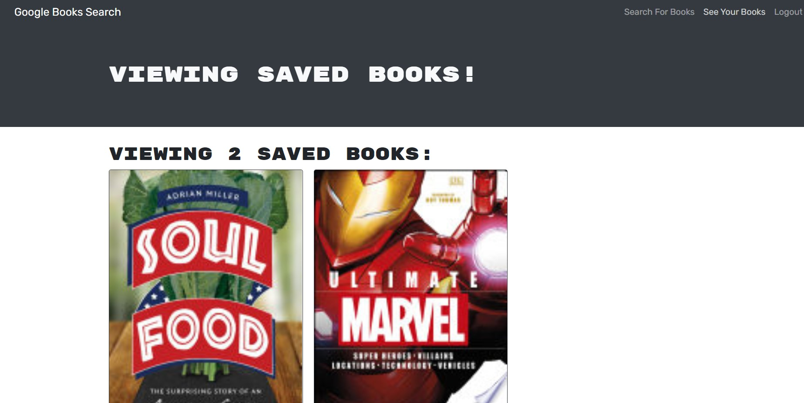

  # Book Search Engine 

  ## Description
  Google Books API search engine built with a RESTful API, and refactor it to be a GraphQL API built with Apollo Server. The app was built using the MERN stack, with a React front end, MongoDB database, and Node.js/Express.js server and API.

  ## Table of Contents
  * [Installation](#installation)
  * [Usage](#usage)
  * [Questions](#questions)
  

  ## Installation
  run npm i to install all dependencies after pulling the repo down.

  ## Usage
  The usgae of this project is to search for any book and save that book if it intrest with the ability to delete the saved book. 
   
  
   
  The deployed link: 

  ## Questions
  If you have any additional questions, please reach out to me. 
  You can reachout to me at my GitHub profile, which is [reaganjoseph26](https://github.com/reaganjoseph26).
  Also, you can reach out to me by email. My email address is reaganjoseph26@yahoo.com. 
  